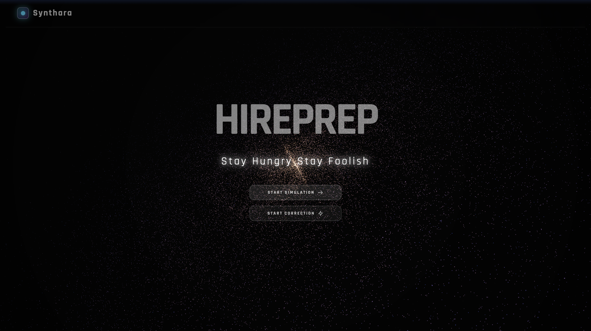
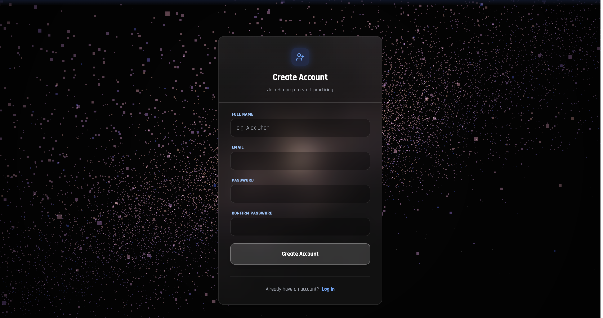
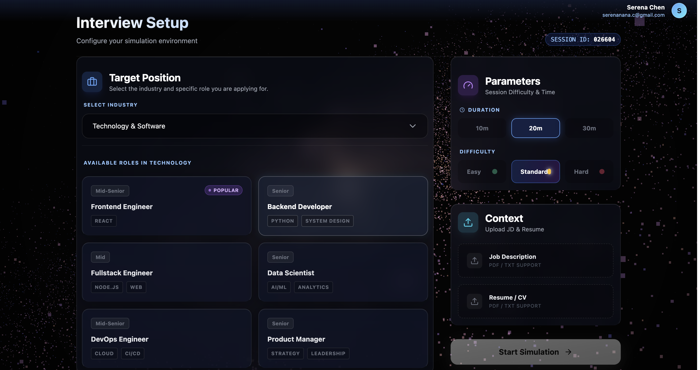
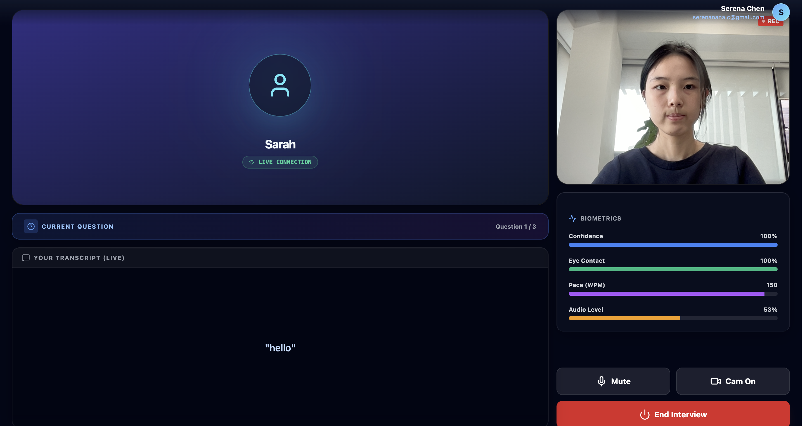
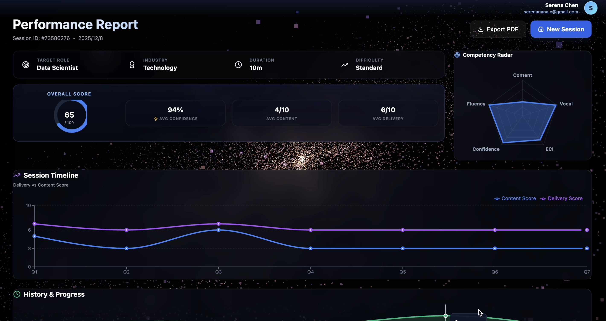
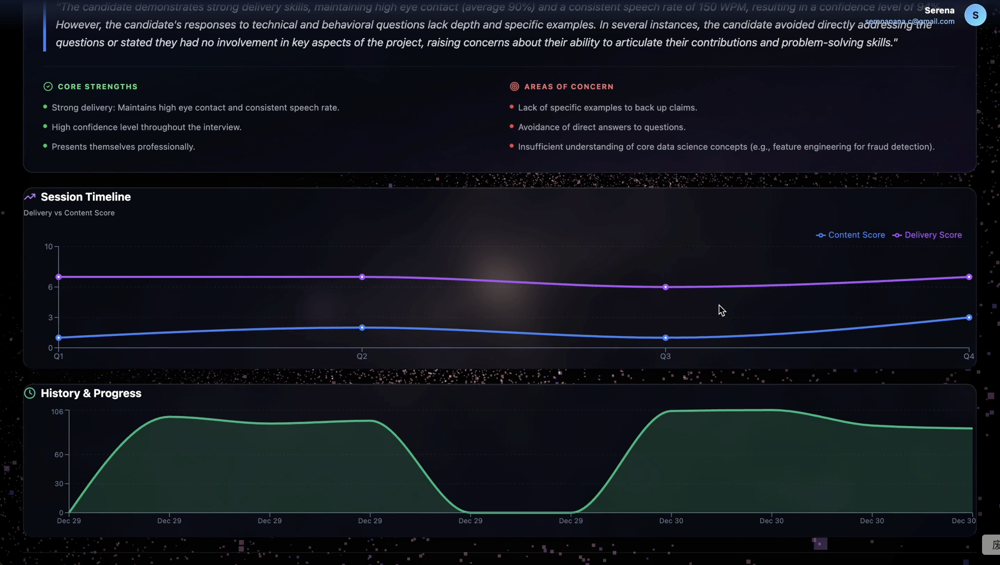

# Hireprep – Multimodal Interview Coach & Simulation Platform

Hireprep is a multimodal interview coach blending AI avatars, real-time audio/video interaction, and behavioral intelligence to create realistic mock interview experiences.

## Key Features

1. **Reasoning-Driven Interview Agent**  
   Uses Gemini Live API to control interview flow: follow-ups, competency switching, wrap-up logic.

2. **Configurable Interview Scenarios**  
   Industry, role, difficulty, duration, JD-aware and resume-aware prompting.

3. **Lightweight Multimodal Analysis**  
   MediaPipe FaceMesh + Iris (gaze, blink, eye-contact) and Web Audio API (speaking rate, pauses, volume).

4. **Comprehensive Feedback**  
   Content scoring, communication metrics, filler words, body-language estimates, trend charts.


## Tech Stack


## Page Previews

### Landing Page


### Sign In


### Sign Up


### Setup Page


### Interview Page


### Feedback Pages
  


---

# Run Locally

**Prerequisites:**  Node.js Backend + React&Vite Fronted

### 1. Install dependencies

```bash
npm install
cd backend
npm install
```

### 2. Set Gemini API Key
Create .env.local:

```bash
GEMINI_API_KEY=your_key_here
```

### 3. Start Backend

```bash
cd backend
node server.js
```

### 4. Start Frontend
```bash
npm run dev
```
