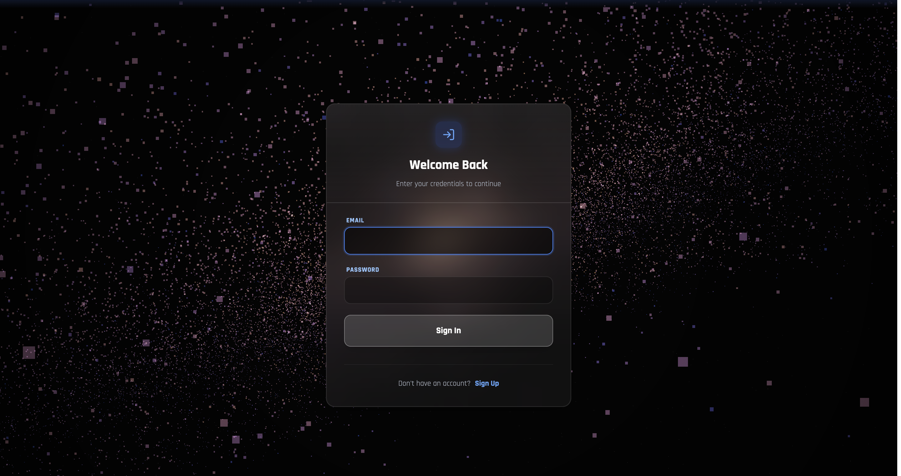
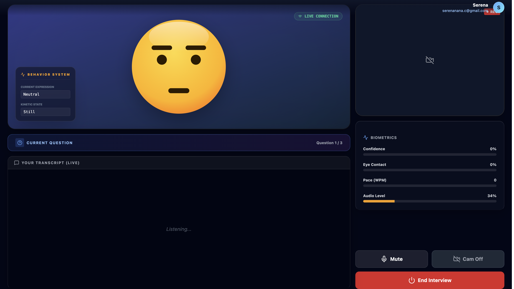
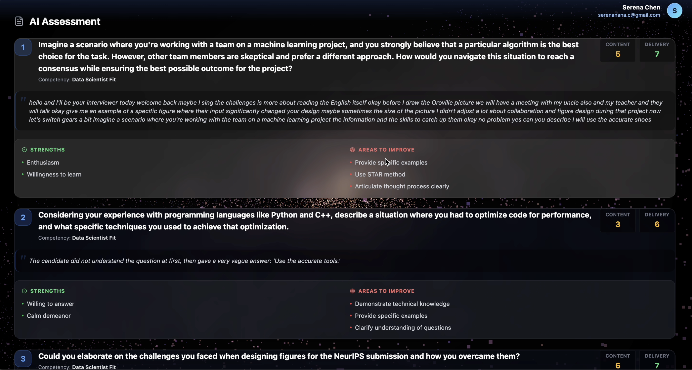
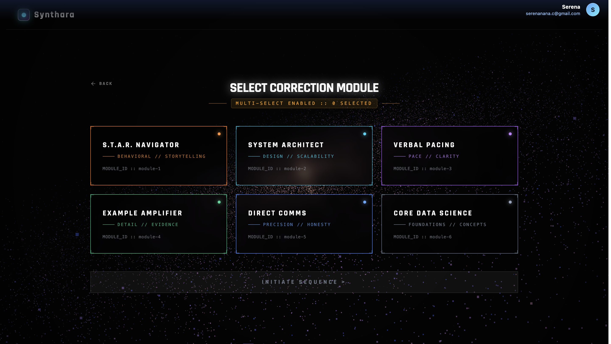
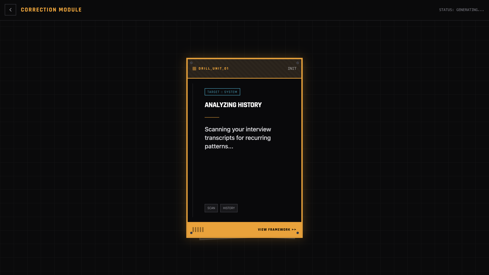
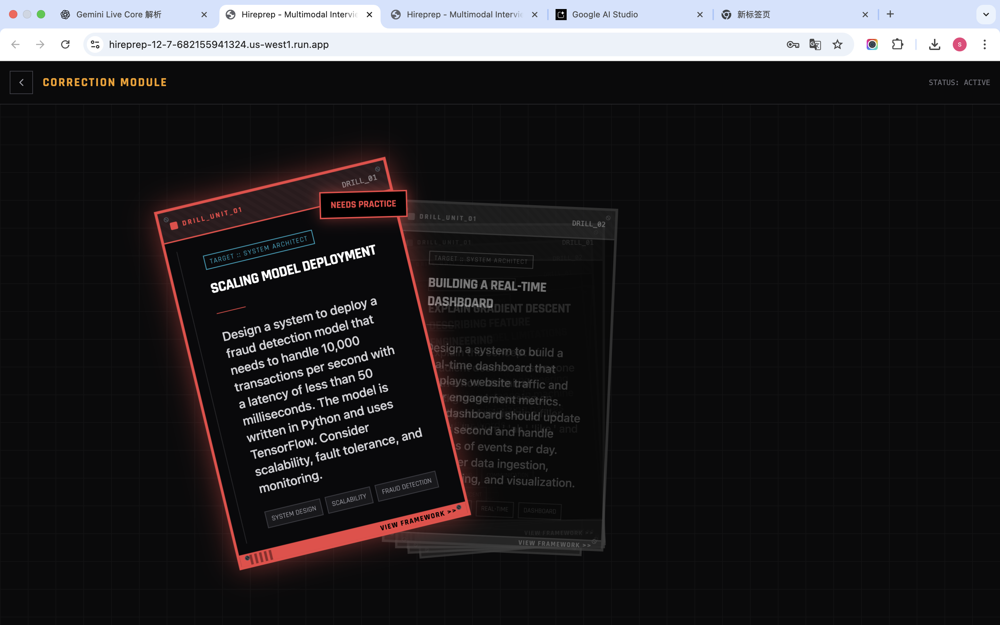
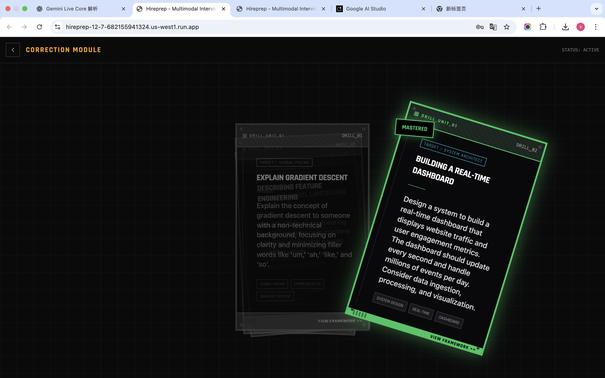
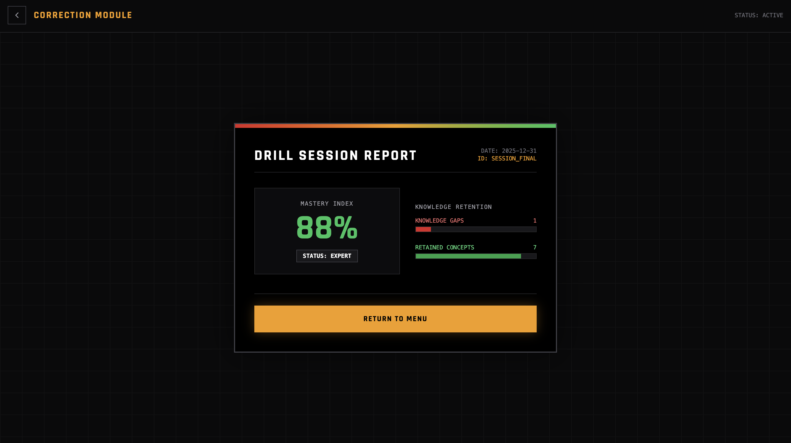

# Hireprep – Multimodal Interview Coach & Simulation Platform

Hireprep is a multimodal interview coach blending AI avatars, real-time audio/video interaction, and behavioral intelligence to create realistic mock interview experiences. It bridges the gap between browser-side Edge AI (biometrics) and Cloud AI (Gemini Live), orchestrated by a deterministic State Machine to ensure a seamless, low-latency interview experience.

## ✨ Key Features

### 🧠 Core Orchestration & Interaction
*Bridging deterministic logic with generative fluidity.*

*   **State-Driven Agent Architecture**  
    Orchestrates complex interview flows (follow-ups, competency switching, wrap-ups) using a **deterministic State Machine** coupled with the **Gemini Live API**. This ensures the AI adheres to strict interview stages while maintaining conversational flexibility.
    
*   **Emotion-Synchronized Communication**  
    Features a **zero-latency reactive avatar** that syncs programmatically with the AI’s emotional state. It mirrors human-like turn-taking dynamics, handling interruptions and active listening through real-time event streams.

### 👁️ Multimodal Edge Intelligence
*Fusing client-side sensing with server-side reasoning.*

*   **Lightweight Biometric Analysis**  
    Leverages browser-side Edge AI—**MediaPipe FaceMesh** for visual cues (eye contact, head pose) and **Web Audio API + VAD** for vocal prosody (pitch, volume, pace)—to capture non-verbal signals without compromising privacy or latency.

*   **Holistic Performance Analytics**  
    Synthesizes biometric data into actionable insights, providing **comprehensive PDF reports** and executive summaries. Metrics include content quality, delivery confidence, and trend charts, visualizing the candidate's growth over time.

### 🔄 Adaptive Context & Correction
*A personalized learning loop powered by RAG.*

*   **Context-Aware Simulations**  
    Generates highly specific interview scenarios by parsing uploaded **Resumes and Job Descriptions (JD)**. The session adapts dynamically to the user's industry, role, and selected difficulty level.

*   **Gamified Correction Module**  
    Closes the feedback loop with a **"Drill Mode"**. Based on detected weaknesses, it generates bite-sized, swipeable practice cards (TikTok-style UI), allowing users to master specific competencies through rapid-fire repetition.

## Tech Stack


## Deployed Website Access

We provide **two deployment versions** of the HirePrep Interview Platform:

### **1. Serverless Deployment (Recommended) — No Backend Required**  
This version runs **entirely in the browser** and does **not require any local backend or database setup**, see [Quick Preview Version](https://hireprep-12-7-1036920270692.us-west1.run.app/)


### **2. Full-Stack Deployment (Requires Local Backend & SQLite)**  
This version connects to the original **Express + SQLite** backend.  
To use this version, you must start the backend server locally, and see [Configured Version](https://hireprep-12-7-32652408982.us-west1.run.app/)

---

## Page Previews

### Landing Page


### Sign In


### Sign Up


### Setup Page


### Interview Page


### Feedback Pages
  



### Correction Page
 
 
 
 
 
 


---

# Run Locally

### 1. Clone the repository

```bash
git clone https://github.com/Serenananah/Hireprep-live.git 
```

### 2. Install dependencies

```bash
npm install
```

This step is needed only when you want to use local js database.
```bash
cd backend
npm install
```

### 3. Set Gemini API Key
Create .env.local:

```bash
GEMINI_API_KEY=your_key_here
```

### 4. Start Backend

Also, this step is optional.
```bash
cd backend
node server.js
```

### 4. Start Frontend
```bash
npm run dev
```
---
## 🔮 Future Roadmap
- [ ] **WebRTC Integration**: Move from WebSocket to WebRTC for even lower latency (sub-300ms).
- [ ] **VR Support**: Porting the Three.js background to a full WebXR experience.
- [ ] **Custom Audio**: Allowing users to clone an interviewer's voice.


## 📄 License
This project is licensed under the MIT License - see the [LICENSE](LICENSE) file for details.